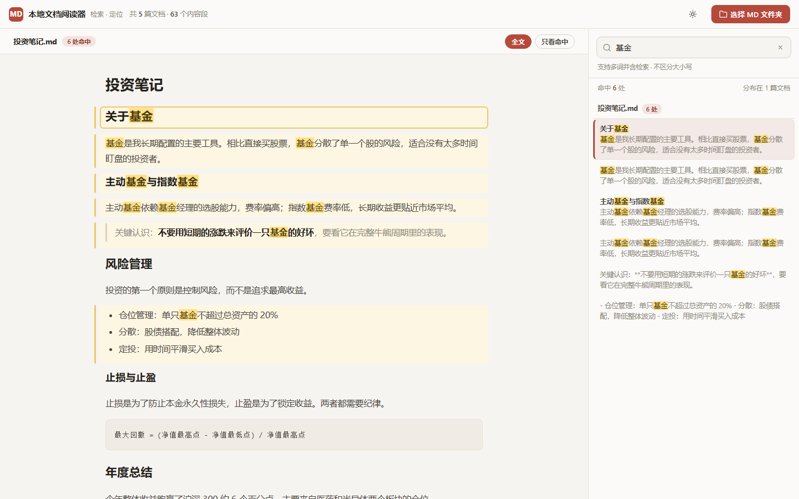

# MD 阅读器

一个纯前端的本地 Markdown 阅读器：把 md 文件拖进来，或者选择整个文件夹，就能跨全部文档检索关键词，一键跳转到命中的具体段落。单文件、零依赖、无需联网、无需安装。



## 功能

- **段落级全文检索**：输入关键词，跨所有文档列出命中的内容段，关键词高亮；支持空格分隔多词并含、大小写不敏感。
- **一键定位**：点右侧任意结果，左侧跳到该文档对应段落，命中段高亮并自动滚动居中。
- **拖拽读入**：把 md 文件直接拖进窗口即可阅读，支持一次拖多个；同名文件自动覆盖。
- **选文件夹**：选择整个文件夹，递归读取所有 `.md` / `.markdown` / `.txt`。
- **Markdown 渲染**：标题、列表、任务列表、引用、表格、代码块、链接、强调、分隔线。
- **深浅主题**：右上角一键切换，记忆偏好。
- **键盘操作**：`/` 聚焦搜索，`↑↓` 切换结果，`Enter` 跳转，`Esc` 清空。
- **分享链接**：支持 `?q=关键词` 参数直接带入检索并定位，例如 `index.html?q=基金`。

## 快速开始

也可以直接从 [Releases](https://github.com/Jesse1024/md-reader/releases) 下载打包好的 zip（含一键安装脚本）。

下载 `index.html`，双击用浏览器打开即可。无需安装、无需联网。

Windows 用户也可以直接双击 `install.bat`，一键装到桌面并生成快捷方式，见下文「安装与桌面快捷方式」。

或克隆仓库：

```bash
git clone https://github.com/Jesse1024/md-reader.git
cd md-reader
start index.html   # Windows
open index.html    # macOS
```

## 使用

1. 把 md 文件拖进窗口，或点右上角「选择 MD 文件夹」。
2. 右侧输入关键词，命中的内容段按文档分组列出。
3. 点任意一条，左侧跳到对应位置。

左侧默认显示全文（能看到上下文），可切「只看命中」只看含关键词的段落。

## 安装与桌面快捷方式（Windows）

**方式一：一键安装（推荐）**

下载并解压仓库后，双击 `install.bat`，脚本会：

1. 把文件复制到 `%LOCALAPPDATA%\MDReader`
2. 在桌面创建「MD Reader」快捷方式（用系统自带的 Edge，以应用模式打开，无地址栏、无标签页）

之后双击桌面「MD Reader」就是独立窗口。脚本会自动检测 Edge，没有 Edge 时回退到 Chrome。

> 若 Windows 提示「来自其他计算机」的安全警告，点「更多信息 → 仍要运行」。

**方式二：便携使用**

不安装，直接双击 `index.html` 用浏览器打开，功能完全一样。

**方式三：手动创建快捷方式**

想自己控制，手动新建快捷方式，目标填：

```
"C:\Program Files (x86)\Microsoft\Edge\Application\msedge.exe" --app="file:///D:/path/to/index.html"
```

把路径换成你解压后的实际位置。

## 更新

两种方式更新到 GitHub 最新版：

- **阅读器内检查**：点顶栏的「刷新」图标按钮，自动对比 GitHub 最新 Release；发现新版时可「立即更新」（会弹保存框，选择覆盖安装目录的 index.html）或「下载安装包」。
- **脚本全自动**：双击安装目录里的 `update.bat`（默认在 `%LOCALAPPDATA%\MDReader\update.bat`），自动下载最新版并覆盖，无需选路径。

版本号写在 `index.html` 的 `<meta name="app-version">` 里，与 Release tag 保持一致；fork 后请把 `index.html` 里的 `UPDATE_REPO` 改成自己的仓库。

## 卸载

- 用 `install.bat` 安装的：双击安装目录里的 `uninstall.bat`（或仓库里的 uninstall.bat），自动删除桌面快捷方式和 `%LOCALAPPDATA%\MDReader`。
- 手动安装的：删除桌面快捷方式 + 删除 index.html 所在目录即可。应用不写注册表、不设自启，没有其他残留。

## 技术说明

- 纯 HTML/CSS/JS 单文件，无构建步骤，无第三方依赖。
- 自研轻量 Markdown 解析器；按标题与空行切分自然段，段落是检索和定位的最小单元。
- 检索为全文遍历式：载入时预生成段落小写文本，输入带 150ms 防抖，实测千篇级文档（数百万字）单次扫描约 2ms，敲字无感；命中超 300 条时仅渲染前 300 条，计数仍显示全部。
- 用 File System Access API 读取本地文件，全程本地处理，不上传、无后端。
- 浏览器不支持 `showDirectoryPicker` 时自动降级为文件选择器。

## 浏览器兼容

| 功能 | Chrome / Edge | Firefox | Safari |
|------|--------------|---------|--------|
| 检索 / 定位 / 渲染 | 支持 | 支持 | 支持 |
| 拖拽读入 | 支持 | 支持 | 支持 |
| 选文件夹 | 支持 | 支持 | 支持 |
| 检查更新（立即更新） | 支持 | 降级为下载 | 降级为下载 |

> 「选文件夹」在 Chrome / Edge 用 File System Access API，在 Firefox / Safari 用 `webkitdirectory`，两者都能选整个文件夹（含子目录）。「立即更新」依赖 `showSaveFilePicker`（仅 Chrome / Edge），Firefox / Safari 自动降级为「下载后手动替换」；`update.bat` 脚本不受浏览器影响。

## 目录结构

```
md-reader/
├── index.html      # 应用主体（单文件）
├── icon.ico        # 图标
├── install.bat     # Windows 一键安装（双击）
├── install.ps1     # 安装脚本（install.bat 调用）
├── update.bat      # Windows 一键更新（双击）
├── update.ps1      # 更新脚本（update.bat 调用）
├── uninstall.bat   # Windows 一键卸载（双击）
├── uninstall.ps1   # 卸载脚本（uninstall.bat 调用）
├── screenshot.png  # 截图
├── CHANGELOG.md    # 更新日志
├── README.md
└── LICENSE
```

## 更新日志

每个版本更新了什么，见 [CHANGELOG.md](CHANGELOG.md)。

## License

[MIT](LICENSE) © 南山怪客
